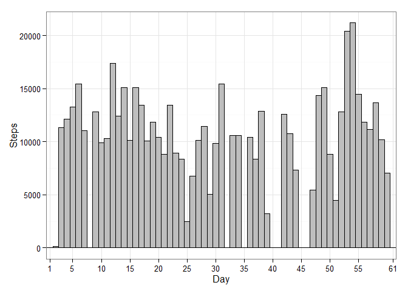
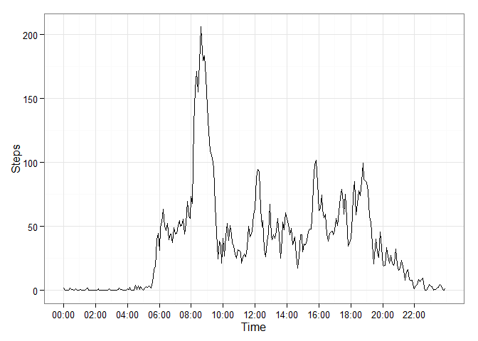
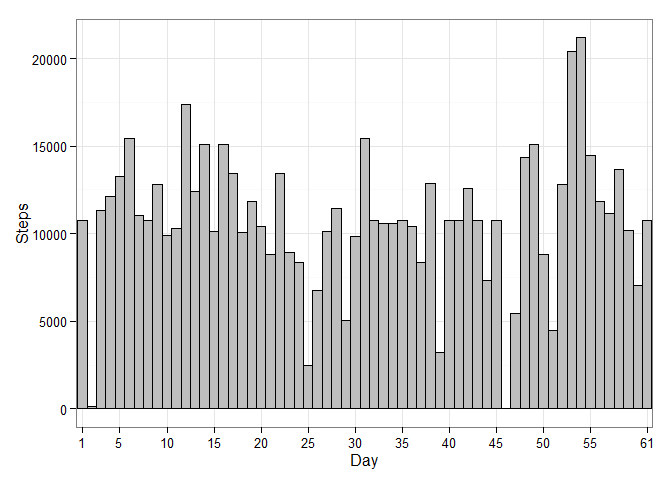

# Reproducible Research: Peer Assessment 1


## Loading and preprocessing the data

```r
# Load libraries
library(data.table)
library(ggplot2)
```

```
## Warning: package 'ggplot2' was built under R version 3.1.3
```

```r
# Load data
data = data.table(read.csv("./data/activity.csv"))
data$date = as.Date(data$date) # Convert date factor to date
```


## What is mean total number of steps taken per day?

```r
stepsPerDay = data[, lapply(.SD, sum, na.rm = TRUE), by = date]
stepsPerDay = stepsPerDay[,day:=as.factor(1:61)]

meanSteps = floor(mean(stepsPerDay$steps, na.rm= TRUE))
medianSteps = floor(median(stepsPerDay$steps, na.rm = TRUE))
```
The mean number of steps taken each day was: 9354.  
The mediam number of steps taken each day was: 1.0395\times 10^{4}.

```r
ggplot(stepsPerDay,aes(x=day, y=steps)) + 
  geom_bar(stat = "identity",width=1,colour="black", fill="grey") + 
  scale_x_discrete( breaks=c(1,seq(5,55,by=5), 61)) + 
  theme_bw() +
  xlab("Day") +
  ylab("Steps")
```

 

## What is the average daily activity pattern?

```r
stepsPerPeriod = data[, lapply(.SD, mean, na.rm = TRUE), by = interval]

tmpTime = stepsPerPeriod$interval
tmpTime2 = mapply(function(x, y) paste0(rep(x, y), collapse = ""), 0, 4 - nchar(tmpTime))
tmpTime = paste0(tmpTime2, tmpTime)
tmpTime = format(strptime(tmpTime, format = "%H%M"), format = "%H:%M")

maxInterval = tmpTime[stepsPerPeriod$steps == max(stepsPerPeriod$steps)]
```
The 5-minute overwhich the most steps are taken, on average, is at 08:35 in the morning.


```r
sizeX = length(stepsPerPeriod$interval)

ggplot(stepsPerPeriod, aes(x=seq(1, sizeX,1), y=steps)) + 
  geom_line() + 
  scale_x_continuous(breaks = seq(1,sizeX, 24) , labels=tmpTime[seq(1,sizeX,24)]) +
  theme_bw() + 
  xlab("Time") +
  ylab("Steps")
```

 

## Imputing missing values
Missing step values were assigned the average of the step values for that interval.

```r
data2 = data
numNA = sum(as.numeric(is.na(data$steps)))

for (i in 1:length(data2$steps)) {
  if(is.na(data2$steps[i])){
    data2$steps[i] = stepsPerPeriod[interval == data2$interval[i], steps]
  }
}

stepsPerDay2 = data2[, lapply(.SD, sum, na.rm = TRUE), by = date]
stepsPerDay2 = stepsPerDay2[,day:=as.factor(1:61)]

meanSteps2 = floor(mean(stepsPerDay2$steps, na.rm= TRUE))


ggplot(stepsPerDay2,aes(x=day, y=steps)) + 
  geom_bar(stat = "identity",width=1,colour="black", fill="grey") + 
  scale_x_discrete( breaks=c(1,seq(5,55,by=5), 61)) + 
  theme_bw() +
  xlab("Day") +
  ylab("Steps")
```

 


## Are there differences in activity patterns between weekdays and weekends?

```r
tmpDays = weekdays(data$date)
weekFactor = factor(as.numeric(tmpDays == "Saturday" | tmpDays == "Sunday") + 1,
                    labels = c("Weekday", "Weekend"))

data = data[, weekFac:=weekFactor]

stepsPerWeekday = data[, lapply(.SD, mean, na.rm = TRUE), by =c("interval", "weekFac")]

tmpTime = stepsPerWeekday$interval
tmpTime2 = mapply(function(x, y) paste0(rep(x, y), collapse = ""), 0, 4 - nchar(tmpTime))
tmpTime = paste0(tmpTime2, tmpTime)
tmpTime = format(strptime(tmpTime, format = "%H%M"), format = "%H:%M")

sizeX = 288

ggplot(stepsPerWeekday, aes(x=c(seq(1, sizeX,1), seq(1, sizeX,1)), y=steps)) + 
  geom_line() + 
  facet_grid(weekFac ~ .) + 
  scale_x_continuous(breaks = seq(1,sizeX, 24) , labels=tmpTime[seq(1,sizeX,24)]) +
  theme_bw() + 
  xlab("Time") +
  ylab("Steps")
```

 
